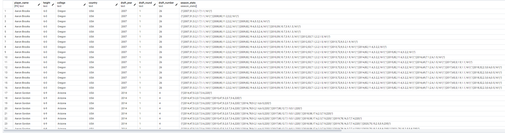
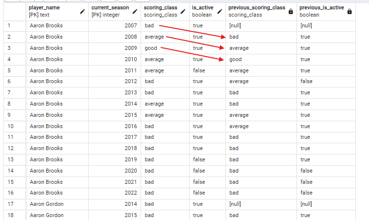
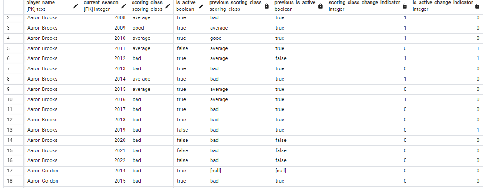
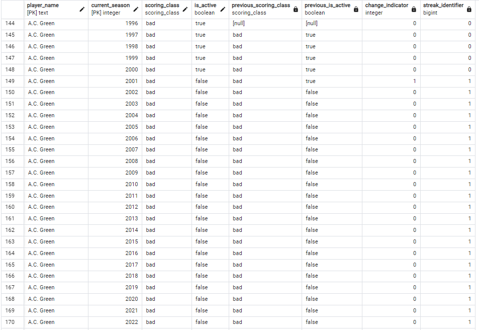
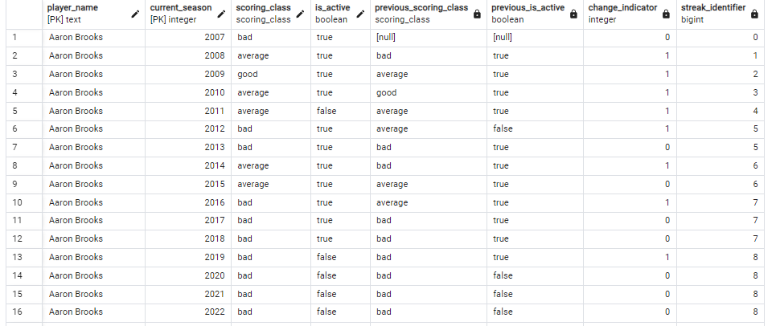

## Building Slowly Changing Dimensions (SCDs)

- On day 1 we created a cumulative table that tracks all of the NBA players stats throughout the seasons.
- Now we are taking those datasets and converting them into slowly changing dimensions type 2.
- But first, we need to drop the existing **`players`** table and create a new one as we want to add new columns for the table.
    ```sql
    DROP TABLE players;
    ```
    ```sql
    CREATE TABLE players (
	player_name TEXT,
	height TEXT,
	college TEXT,
	country TEXT,
	draft_year TEXT,
	draft_round TEXT,
	draft_number TEXT,
	season_stats season_stats[],
	scoring_class scoring_class,
	years_since_last_season INTEGER,
	current_season INTEGER,
	is_active BOOLEAN,
	PRIMARY KEY (player_name, current_season));
    ```
- Run the following query to populate the table. The query generates a series for all the seasons and create an array that contains accumulation of past **`season_ stats`** value up until the current season.

    ```sql
    INSERT INTO players
    WITH years AS (
        SELECT *
        FROM generate_series (1996, 2022) as season
    ),
    p AS (
        SELECT player_name, MIN(season) AS first_season
        FROM player_seasons
        GROUP BY player_name
    ),
    players_and_seasons AS (
        SELECT *
        FROM p
        JOIN years y ON p. first_season <= y. season
    ),
    windowed AS (
            SELECT ps.player_name, ps.season,
                    array_remove(ARRAY_AGG(CASE
                                    WHEN p1.season IS NOT NULL THEN
                                    ROW(p1.season, p1.gp, p1.pts, p1.ast, p1.reb, p1.weight)::season_stats
                                    END)
                                OVER(PARTITION BY ps.player_name ORDER BY COALESCE(p1.season, ps.season)),
                                null) as seasons
            FROM players_and_seasons ps
            LEFT JOIN player_seasons p1
                ON ps.player_name = p1.player_name
                    AND ps.season = p1.season
        ORDER BY ps.player_name, ps.season
        ),
        static AS (
            SELECT player_name,
                max(height)         as height,
                max(college)        as college,
                max(country)        as country,
                max(draft_year)     as draft_year,
                max(draft_round)    as draft_round,
                max(draft_number)   as draft_number
            FROM player_seasons
            GROUP BY player_name
    )

    SELECT w.player_name,
        s.height,
        s.college,
        s.country,
        s.draft_year,
        s.draft_round,
        s.draft_number,
        seasons as season_stats,
        CASE
            WHEN (seasons[cardinality(seasons)]::season_stats).pts > 20 THEN 'star'
            WHEN (seasons[cardinality(seasons)]::season_stats).pts > 15 THEN 'good'
            WHEN (seasons[cardinality(seasons)]::season_stats).pts > 10 THEN 'average'
        ELSE 'bad'
        END::scoring_class as scoring_class,
        w.season - (seasons[cardinality(seasons)]::season_stats).season as years_since_last_season,
        w.season,
        (seasons[cardinality(seasons)]::season_stats).season = season AS is_active
    FROM windowed w
        JOIN static s ON w.player_name = s.player_name;
    ```
- Run ```sql SELECT * FROM players``` and the result of the query is as below. The **`season_ stats`** array builds up for every season.

    

- Next, we want to create an SCD table that essentially tracks changes in these two columns throughout the season: **`scoring_class`** and **`is_active`**. Create an SCD table named **`players_scd`**. Because this table is SCD type 2, we will add two more columns **`start_season`** and **`end_season`**. This is now a properly modelled SCD
    ```sql
    CREATE TABLE players_scd (
        player_name TEXT,
        scoring_class scoring_class,
        is_active BOOLEAN,
        start_season INTEGER,
        end_season INTEGER,
        current_season INTEGER,
        PRIMARY KEY (player_name, current_season)
    );
    ```

- Players table has data all the way back to 1996. How do we create a players table with no current_season filter? We want to calculate the streak, like how many seasons or how long that they were active in the current dimension? How we dothat is we look at what was the dimension before. We use window function which is LAG
- We need to use the LAG() window function to create a new column called **`previous_scoring_class`** that accesses a previous row of **`scoring_class`** from the previous season. Use **`LAG(scoring_class, 1)`** where value 1 is the offset parameter that specifies how many rows above the current row we want the LAG() function to get the value from. The same thing must be done to create **`previous_is_active`** column.

    ```sql
    SELECT
        player_name,
        current_season,
        scoring_class,
        is_active,
        LAG(scoring_class, 1) OVER (PARTITION BY player_name ORDER BY current_season) AS previous_scoring_class,
        LAG(is_active, 1) OVER (PARTITION BY player_name ORDER BY current_season) AS previous_is_active
    FROM players
    ```
- The output from the query above:

    

- Building up from the query above, we need to create an indicator to see whether or not the two dimensions (column **`scoring_class`** and **`is_active`**) changes from the previous season. Use the CASE statement that indicates 1 when there is change from previous season and 0 if there is no change.

    ```sql
    WITH with_previous AS (
    SELECT
        player_name,
        current_season,
        scoring_class,
        is_active,
        LAG(scoring_class, 1) OVER (PARTITION BY player_name ORDER BY current_season) AS previous_scoring_class,
        LAG(is_active, 1) OVER (PARTITION BY player_name ORDER BY current_season) AS previous_is_active
    FROM players
    )

    SELECT *,
        CASE
            WHEN scoring_class <> previous_scoring_class THEN 1
            ELSE 0
        END AS scoring_class_change_indicator,
        CASE
            WHEN is_active <> previous_is_active THEN 1
            ELSE 0
        END AS is_active_change_indicator
    FROM with_previous;
    ```

- The output from the query above:

    

- Next step is we are going to create a new metric called **`streak_identifier`** that will track the number of state changes for the value of both **`scoring_class`** and **`is_active`**. Before that, we need to consolidate or combine the changes from **`scoring_class`** and **`is_active`** into one indicator called **`change_indicator`** as we want to track changes from either one of these two columns.

- We also want to total up the value of **`change_indicator`** so that we can keep up of the streaks for each player.

    ```sql
    WITH with_previous AS (
    SELECT
        player_name,
        current_season,
        scoring_class,
        is_active,
        LAG(scoring_class, 1) OVER (PARTITION BY player_name ORDER BY current_season) AS previous_scoring_class,
        LAG(is_active, 1) OVER (PARTITION BY player_name ORDER BY current_season) AS previous_is_active
    FROM players
    ),

    with_indicators AS (
    SELECT *,
        CASE
            WHEN scoring_class <> previous_scoring_class THEN 1
            WHEN is_active <> previous_is_active THEN 1
            ELSE 0
        END AS change_indicator
    FROM with_previous
    )

    SELECT * ,
        SUM(change_indicator) OVER (PARTITION by player_name ORDER BY current_season) AS streak_identifier
    FROM with_indicators
    ```

- From the query above we can see that the player A.C. Green becomes inactive in 2001 and so the **`change_indicator`** turns to 1. He remains inactive throughout the seasons so there are no more state changes, the **`streak_identifier`** remains 1 indicating only 1 state change for A.C. Green from 1996 to 2022. However, Aaron Brooks has many state changes as shown by the last **`streak_identifier`** of value 8. This is essentially the purpose of building SCD table as we are tracking for changes over time.
    

    

- We want to filter down this just a little bit so that the current_season is less than 2021 so that we can incrementally add 2022 season.

