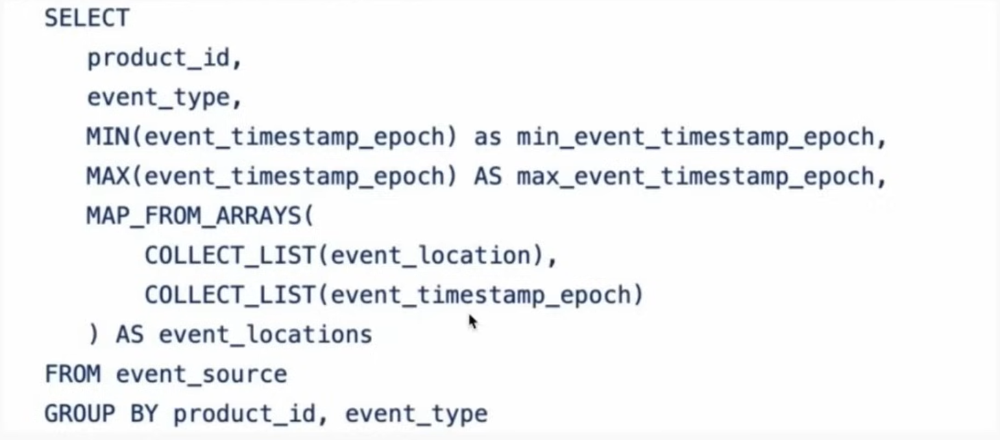
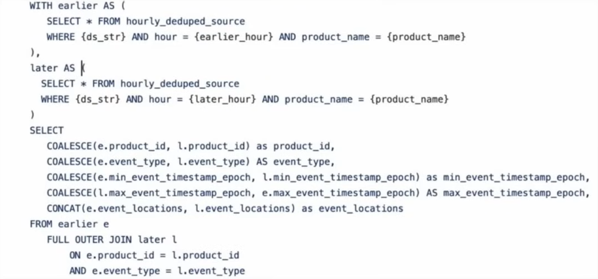
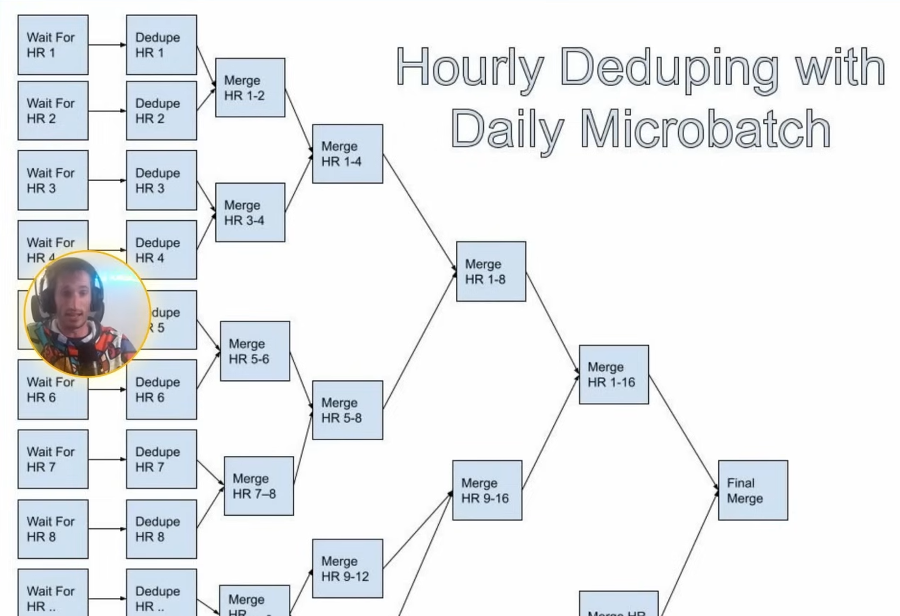

## What is a fact?

- Think of a fact as something that happended or occured.
    - A user logs in to an app
    - A transaction is made
    - You run a mile with your fitbit
- Facts are not slowly changing which makes them easier to model than dimensions in some respects.

## What makes fact modelling hard?

- Fact data is usually 10-100x the volume of dimension data
    - Facebook had 2B active users when Zach worked there and sent 50B notifications every day
- Fact data can need a lot of context for effective analysis
    - Say FB sent a notification, 20 minutes later you click on it, 5 minutes later you bought something. We have that funnel of sent to click to bought, all 3 activities are facts. If we have a notification in isolation, it is worthless.
    - Think about what other data or dimension do we need to make this fact data more valuable? Another example say that we don't have that conversion step/ that purchase step but we have sent and click / click through rate, we brought in another dimension which is user, now we can see that user in Canada has a better click through rate compared to US.
- Duplicates in facts are way more common than in dimensional data
    - Caused by software engineer team pushing a bug in the logger that logs 2 records everytime a user clicks.

## How does fact modeling work

- Normalization vs Denormalization
    - Normalized facts don't have any dimensional attributes, just IDs to join to get that information.
        - User ID 17 logged in at this date, this is a record
    - Denormalized facts bring in some dimensional attributes for quicker analysis at the cost of more storage.
        - User ID 17 name Zach, 29 year old from US, this is a record
        - Brings in more dimension by joins
- Both normalized and denormalized fatcs have a place in this world.
- Fact data and raw logs are not the same thing
    - Raw logs
        - Ugly schemas designed for online systems that make data analysis sad
        - Potentially contains duplicates and other quality errors
        - Usually have shorter retention
        - At FB, the raw logs are owned by software engineers who works with online systems and keeping the server running so they don't really care about log data. As a data engineer, work with software engineer to get the data logged in the correct format
    - Fact data
        - Nice column names
        - Quality guarantees like uniqueness, not null, etc
        - Longer retention
- Think of it as a few Who, What, Where, When, and How
    - "Who" fields are usually pushed out as IDs (this user clicked this button, we only hold the user_id not the entire user object)
    - "Where" fields are most likely modeled out like Who with "IDs" to join, but more likely to bring in dimensions, especially if they're high cardinality like "device_id"
    - "How" fields are very similar to "Where" fields. "He used an iphone to make this click"
    - "What" fields are fundamentally part of the nature of the fact
        - In notification world - "GENERATED", "SENT", "CLICKED", "DELIVERED"
    -"When" fields are fundamentally part of the nature of the fact
        - Mostly an "event_timestamp" field or "event_date"
- Fact datasets should have quality guarantees
    - If they didn't, analysis would just go to the raw logs!
    - No duplicates, "What" and "When" fields should always be not null
- Fact data should generally be smaller than raw logs
- Fact data should parse out hard-to-understand columns!

## When should you bring or model in dimensions?

- Example
    - Network logs pipeline (link)
    - The largest pipeline Zach ever worked on. Over 100 TBs/hr
    - We wanted to see which microservice app each network request came from and went to
    - Modeling this as a traditional fact data
    - IP address would be the identifier for the app
    - This worked for IPv4 domains because the cardinality was small enough (5 GB)
    - This pipeline design couldn't be used to support IPv6 domains though because that search space was too large to be broadcasted
- Example solution
    - The slam dunk solution here was to log the "app" field with each network request and getting rid of the join entirely. DENORMALIZATION SAVES THE DAY
    - This required each microservice to adopt a "sidecar proxy" that enabled logging of which app they were!
    - A large organizational effort to solve this issue

## How does logging fit into fact data?

- Logging brings in all the critical context for your fact data
    - Usually done in collaboration with online system engineers
- Don't log everything!
    - Log only what you really need
    - Storing logs can cause cost to increase
- Logging should conform to values specified by the online teams
    - Thrift is what is used at Airbnb and Netflix for this

## Potential options when working with high volume fact data

- Sampling
    - Doesn't work for all use cases, works best for metric-drive use-cases where imprecision isn't an issue
- Bucketing
    - Fact data can be bucketed by one of the important dimensions (usually user)
    - Bucket joins can be much faster than shuffle joins
    - Sorted-merge Bucket (SMB) joins can do joins without Shuffle at all!

## ow long should you hold onto fact data?

- High volumes make fact data much more costly to hold onto for a long time
- Big tech had an interesting approach here
    - Any fact tables <10 TBs, Retention didn't matter much
        - Anonymization of facts of facts ususally happened after 60-90 days though and the data would be moved to a new table with the Pll stripped
    - Any fact tables>100 TBs, VERY SHORT RETENTION (~14 days or less)

## Deduplication of fact data

- Facts can be deduplicated
    - You can click a notification multiple times
- How do you pick the right window for deduplication?
    - No duplicates in a day? An hour? A week?
    - Looking at distributtions of duplicates here is a good idea
- Intraday deduping options
    - Streaming
    - Microbatch
- Streaming allows you to capture most duplicates in a very efficient manner
    - Windowing matters here
    - Entire day duplicates can be harder for streaming because it needs to hold onto such a big window of memory
    - A large memory of duplicates usually happen within a short time ofc first evennt
    - 15 minute to hourly windows are a sweet spot

## Hourly Microbatch Dedupe

- Used to reduce landing time of daily tables that dedupe slowlu
- Worked at Facebook using this pattern
    - Deduplicated 50 billion notification events every day
    - Reduced landing time form 9 hours after UTC to 1 hout after UTC
- Dedupe each hour with GROUP BY
    - The GROUP BY eliminates duplicates within that 1 hour
- Use SUM and COUNT to aggregate duplicates, use COLLECT_LIST to collect metadata about the duplicates that might be different!
    
    

- Dedupe between hours with FULL OUTER JOIN like branches of a tree
    - FULL OUTER JOIN between hour 0 and 1, and then hour 2 and 3, and this will eliminate duplicates between each hour
- Use left.value + right.value to keep duplicates aggregation correctly counting or CONCAT to build a continuous list

    

- Diagram of hourly deduping with daily microbatch:

    
