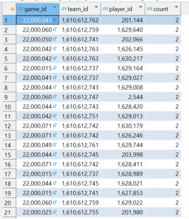
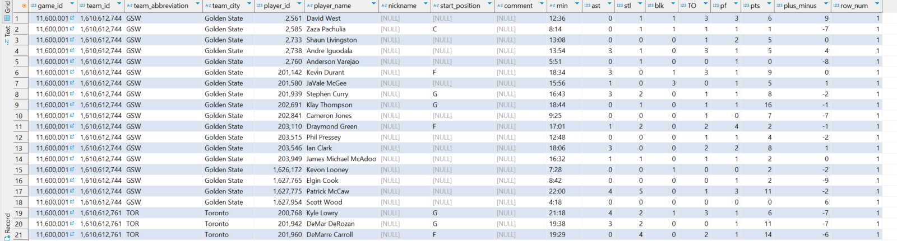
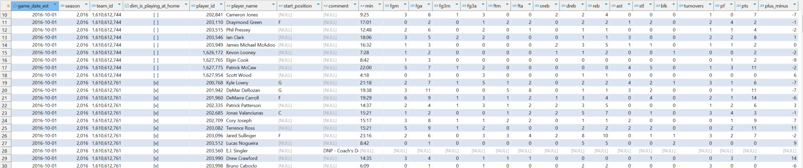
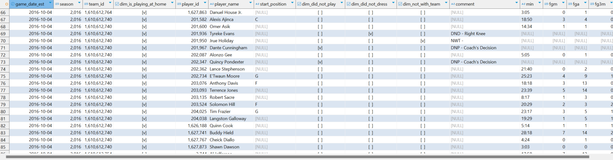
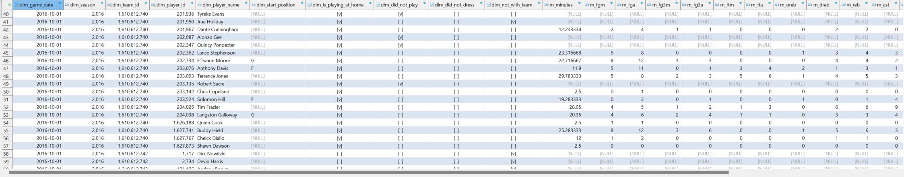
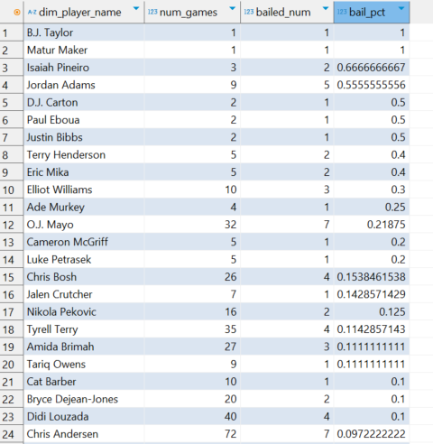

# Fact Data Modeling Day 1 Lab Notes

- For this lab we are going to be using the table **`game_details`** and also **`games`**
- When we are working with a fact table, the grain of the table matters a lot. Let's see if we have duplicates for the fields **`game_id`**, **`team_id`**, and **`player_id`**

    ```sql
    SELECT
        game_id, team_id, player_id, COUNT(1)
    FROM game_details
    GROUP BY 1,2,3
    HAVING COUNT(1) > 1
    ```

- There's almost 2 of every records in the table

    

- We want to create a filter to remove the duplicates. We filter on **`row_num`** = 1 to get rid of the duplicates

    ```sql
    WITH deduped AS (

        SELECT 
            *, ROW_NUMBER() OVER(PARTITION BY game_id, team_id, player_id) AS row_num
        FROM game_details
            
    )
    SELECT * FROM deduped
    WHERE row_num = 1
    ```
    

- The problem with the current fact table is that we have some columns that we don't need and we also have some missing columns. We need the "When" column and we can get this by joining to **`games`** table to get the **`game_date_est`** column

    ```sql
    WITH deduped AS (

        SELECT 
            g.game_date_est,
            gd.*,
            ROW_NUMBER() OVER(PARTITION BY gd.game_id, team_id, player_id ORDER BY g.game_date_est) AS row_num
        FROM game_details gd
            JOIN games g ON gd.game_id = g.game_id
            
    )
    SELECT * FROM deduped
    WHERE row_num = 1
    ```

- Let's include only the columns that we care about in this fact table. Have a look at **`games`** table and see which columns should we bring to the fact table.
- We need **`home_team_id`** and **`visitor_team_id`** because we want to see if a player plays better when they're at home or away. But we aren't going to store them as columns, we're just going to use them to determine other things.
- We're going to use **`g.home_team_id`** and **`g.visitor_team_id`** to compare the **`team_id`** and **`game_details`** to see whether they are playing at home or away. They will be like a Boolean true or false in the fact table.
- We don't really need **`game_id`** because every other columns in **`games`** is an aggregate and we can just aggregate the games that happens on that day and we can get back all the aggregated data ourselves.
- As we have this line `team_id = home_team_id AS dim_is_playing_at_home` so we don't need **`g.visitor_team_id`** anymore as the result of **`dim_is_playing_at_home`** column will say True if the player are playing at home and False if they are playing away.

    ```sql
    WITH deduped AS (

        SELECT 
            g.game_date_est,
            g.season,
            g.home_team_id,
            gd.*,
            ROW_NUMBER() OVER(PARTITION BY gd.game_id, team_id, player_id ORDER BY g.game_date_est) AS row_num
        FROM game_details gd
            JOIN games g ON gd.game_id = g.game_id
            
    )
    SELECT
        game_date_est,
        season,
        team_id,
        team_id = home_team_id AS dim_is_playing_at_home,
        player_id,
        player_name,
        start_position,
        comment,
        min,
        fgm,
        fga,
        fg3m,
        fg3a,
        ftm,
        fta,
        oreb,
        dreb,
        reb,
        ast,
        stl,
        blk,
        "TO" AS turnovers,
        pf,
        pts,
        plus_minus
    FROM deduped
    WHERE row_num = 1
    ```

    

- From the query above, the columns that we kept in the SELECT statement are fundamental nature of a fact.
- Next, the **`comment`** column is hard to work with as it has high cardinality.
    - DNP: Did Not Play. Sitting on the bench but not play
    - DND: Did Not Dress. They show up to the arena but are not going to play as they don't wear their uniform
    - NWT: Not even in the arena
- The **`comment`** column is a great example of a raw data column that we need to parse, as it can be facts that we can learn about the players.
- Let's create **`dim_did_not_play`**, **`dim_did_not_dress`**, **`dim_not_with_team`** out of the **`comment`** column. If the condition is true for each column, a check mark will appear. These columns are way easier to work with compared to the **`comment`** column. This is a common thing that happens when working with fact data.

    ```sql
    WITH deduped AS (

        SELECT 
            g.game_date_est,
            g.season,
            g.home_team_id,
            gd.*,
            ROW_NUMBER() OVER(PARTITION BY gd.game_id, team_id, player_id ORDER BY g.game_date_est) AS row_num
        FROM game_details gd
            JOIN games g ON gd.game_id = g.game_id
        WHERE g.game_date_est = '2016-10-04' --FILTER ON this date so we don't need TO see a lot OF data
            
    )
    SELECT
        game_date_est,
        season,
        team_id,
        team_id = home_team_id AS dim_is_playing_at_home,
        player_id,
        player_name,
        start_position,
        COALESCE(POSITION('DNP' IN comment), 0) > 0 AS dim_did_not_play,
        COALESCE(POSITION('DND' IN comment), 0) > 0 AS dim_did_not_dress,
        COALESCE(POSITION('NWT' IN comment), 0) > 0 AS dim_not_with_team,
        comment,
        min,
        fgm,
        fga,
        fg3m,
        fg3a,
        ftm,
        fta,
        oreb,
        dreb,
        reb,
        ast,
        stl,
        blk,
        "TO" AS turnovers,
        pf,
        pts,
        plus_minus
    FROM deduped
    WHERE row_num = 1
    ```

    

- For the **`min`** column, we need to change minutes to fractions and from TEXT to REAL type.

    ```sql
    WITH deduped AS (

        SELECT 
            g.game_date_est,
            g.season,
            g.home_team_id,
            gd.*,
            ROW_NUMBER() OVER(PARTITION BY gd.game_id, team_id, player_id ORDER BY g.game_date_est) AS row_num
        FROM game_details gd
            JOIN games g ON gd.game_id = g.game_id
        WHERE g.game_date_est = '2016-10-04' --filter ON this date so we don't need to see a lot of data
            
    )
    SELECT
        game_date_est,
        season,
        team_id,
        team_id = home_team_id AS dim_is_playing_at_home,
        player_id,
        player_name,
        start_position,
        COALESCE(POSITION('DNP' IN comment), 0) > 0 AS dim_did_not_play,
        COALESCE(POSITION('DND' IN comment), 0) > 0 AS dim_did_not_dress,
        COALESCE(POSITION('NWT' IN comment), 0) > 0 AS dim_not_with_team,
        CAST(SPLIT_PART(min, ':', 1) AS REAL) + CAST(SPLIT_PART(min, ':', 2) AS REAL)/60 AS minutes,
        fgm,
        fga,
        fg3m,
        fg3a,
        ftm,
        fta,
        oreb,
        dreb,
        reb,
        ast,
        stl,
        blk,
        "TO" AS turnovers,
        pf,
        pts,
        plus_minus
    FROM deduped
    WHERE row_num = 1
    ```
- Let's create the DDL:

     ```sql
     CREATE TABLE fct_game_details (
        dim_game_date DATE,
        dim_season INTEGER,
        dim_team_id INTEGER,
        dim_player_id INTEGER,
        dim_player_name TEXT,
        dim_start_position TEXT,
        dim_is_playing_at_home BOOLEAN,
        dim_did_not_play BOOLEAN,
        dim_did_not_dress BOOLEAN,
        dim_not_with_team BOOLEAN,
        m_minutes REAL,
        m_fgm INTEGER,
        m_fga INTEGER,
        m_fg3m INTEGER,
        m_fg3a INTEGER,
        m_ftm INTEGER,
        m_fta INTEGER,
        m_oreb INTEGER,
        m_dreb INTEGER,
        m_reb INTEGER,
        m_ast INTEGER,
        m_stl INTEGER,
        m_blk INTEGER,
        m_turnovers INTEGER,
        m_pf INTEGER,
        m_pts INTEGER,
        m_plus_minus INTEGER,
        PRIMARY KEY (dim_game_date, dim_team_id, dim_player_id)
    )
     ```

     ```sql
    INSERT INTO fct_game_details

    WITH deduped AS (

        SELECT 
            g.game_date_est,
            g.season,
            g.home_team_id,
            gd.*,
            ROW_NUMBER() OVER(PARTITION BY gd.game_id, team_id, player_id ORDER BY g.game_date_est) AS row_num
        FROM game_details gd
            JOIN games g ON gd.game_id = g.game_id
            
    )
    SELECT
        game_date_est AS dim_game_date,
        season AS dim_season,
        team_id AS dim_team_id,
        player_id AS dim_player_id,
        player_name AS dim_player_name,
        start_position AS dim_start_position,
        team_id = home_team_id AS dim_is_playing_at_home,
        COALESCE(POSITION('DNP' IN comment), 0) > 0 AS dim_did_not_play,
        COALESCE(POSITION('DND' IN comment), 0) > 0 AS dim_did_not_dress,
        COALESCE(POSITION('NWT' IN comment), 0) > 0 AS dim_not_with_team,
        CAST(SPLIT_PART(min, ':', 1) AS REAL) + CAST(SPLIT_PART(min, ':', 2) AS REAL)/60 AS m_minutes,
        fgm AS m_fgm,
        fga AS m_fgm,
        fg3m AS m_fg3m,
        fg3a AS m_fg3a,
        ftm AS m_ftm,
        fta AS m_fta,
        oreb AS m_oreb,
        dreb AS m_dreb,
        reb AS m_reb,
        ast AS m_ast,
        stl AS m_stl,
        blk AS m_blk,
        "TO" AS m_turnovers,
        pf AS m_pf,
        pts AS m_pts,
        plus_minus AS m_plus_minus
    FROM deduped
    WHERE row_num = 1;
     ```

    

- The naming conventions help people to be aware of what action we can perform with the columns for example:
    - Columns that start with `dim` are columns that we should filter on and do a GROUP BY on.
    - Columns that start with `m` are columns that we should aggregates and do all sort of math calculations on.
- Let's find the player in NBA who bailed out on the most games. We will find the percentage of bails from the total games played by each player.

    ```sql
    SELECT
        dim_player_name,
        COUNT(1) AS num_games,
        COUNT(CASE WHEN dim_not_with_team THEN 1 END) AS bailed_num,
        CAST(COUNT(CASE WHEN dim_not_with_team THEN 1 END) AS REAL)/COUNT(1) AS bail_pct
    FROM fct_game_details
    GROUP BY 1
    ORDER BY 4 DESC
    ```

    

- From the above query, we can see that fact data modeling is powerful and we were able to answer some cool questions with the dataset that would have been difficult to answer using the old data model.