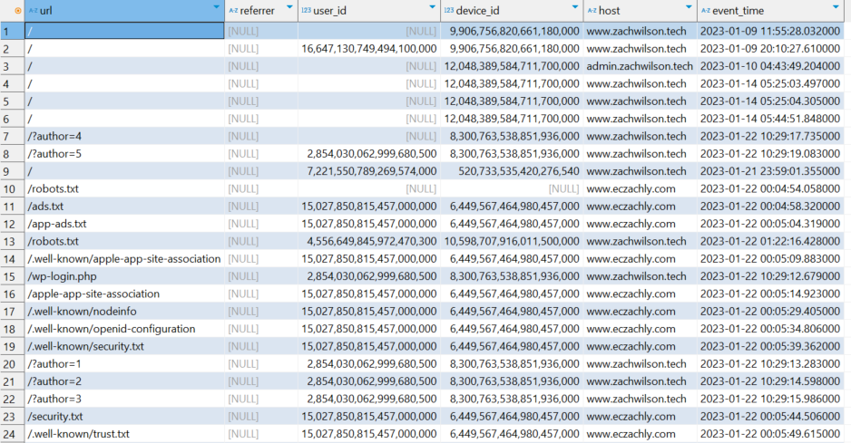
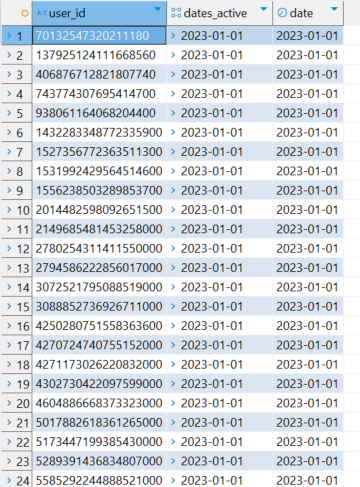
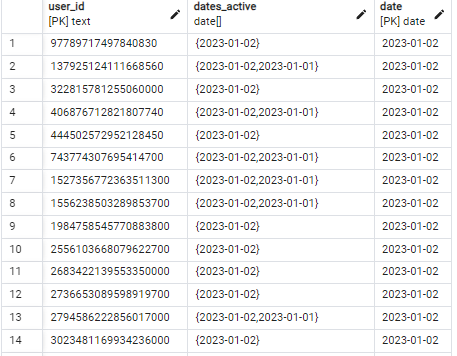
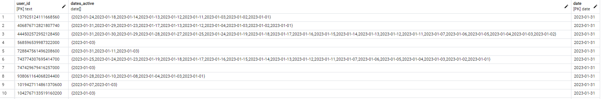
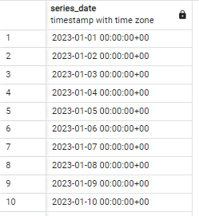
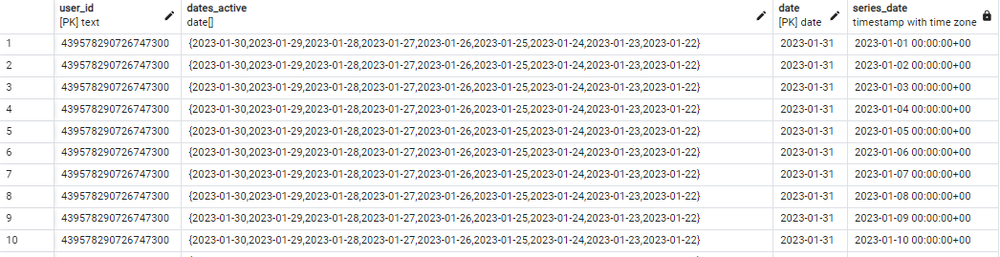
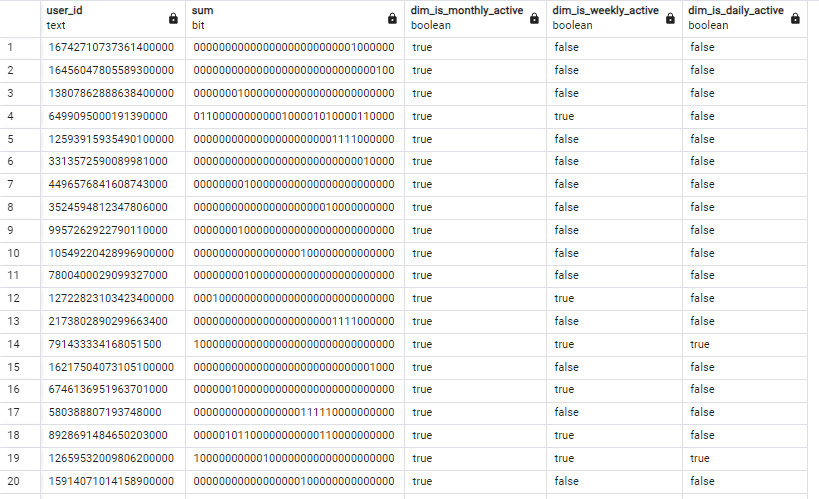

# Fact Data Modeling Day 2 Lab Notes

- For this lab we are going to be using the table **`events`**. It contains every network requests/hacker to Zach's website

    

- We can cumulate **`user_id`** and find all the days that different users are active
- Let's create the DDL for table **`users_cumulated`**

    ```sql
    CREATE TABLE users_cumulated (
        user_id TEXT,
        -- The list of dates in the past where the user was active
        dates_active DATE[],
        -- The current date for user
        date DATE,
        PRIMARY KEY (user_id, date)
    )
    ```

- We want to start with the date 2023-01-01 so **`user_id`** would be 2022-12-31

    ```sql
    INSERT INTO users_cumulated
    WITH yesterday AS (
        SELECT
            *
        FROM users_cumulated
        WHERE date = DATE('2022-12-31')

    ),

    today AS (
        SELECT
            CAST(user_id AS TEXT) AS user_id,
            DATE(CAST(event_time AS TIMESTAMP)) AS date_active
        FROM events
        WHERE
            DATE(CAST(event_time AS TIMESTAMP)) = DATE('2023-01-01')
            AND user_id IS NOT NULL
        GROUP BY user_id, DATE(CAST(event_time AS TIMESTAMP))
    )

    SELECT
        COALESCE(t.user_id, y.user_id) AS user_id,
        CASE WHEN y.dates_active IS NULL
            THEN ARRAY[t.date_active]
            WHEN t.date_active IS NULL THEN y.dates_active
            ELSE ARRAY[t.date_active] || y.dates_active
            END
            AS dates_active,
        COALESCE(t.date_active, y.date + INTERVAL '1 day') AS date
    FROM today t
    FULL OUTER JOIN yesterday y
    ON t.user_id = y.user_id    
    ```

- Run the query `SELECT * FROM users_cumulated` and the result:

    

- Next, we want to build up the table **`users_cumulated`** so let's change the yesterday date to '2023-01-01' and today to '2023-01-02'

    ```sql
    INSERT INTO users_cumulated
    WITH yesterday AS (
        SELECT
            *
        FROM users_cumulated
        WHERE date = DATE('2023-01-01')

    ),

    today AS (
        SELECT
            CAST(user_id AS TEXT) AS user_id,
            DATE(CAST(event_time AS TIMESTAMP)) AS date_active
        FROM events
        WHERE
            DATE(CAST(event_time AS TIMESTAMP)) = DATE('2023-01-02')
            AND user_id IS NOT NULL
        GROUP BY user_id, DATE(CAST(event_time AS TIMESTAMP))
    )

    SELECT
        COALESCE(t.user_id, y.user_id) AS user_id,
        CASE WHEN y.dates_active IS NULL
            THEN ARRAY[t.date_active]
            WHEN t.date_active IS NULL THEN y.dates_active
            ELSE ARRAY[t.date_active] || y.dates_active
            END
            AS dates_active,
        COALESCE(t.date_active, y.date + INTERVAL '1 day') AS date
    FROM today t
    FULL OUTER JOIN yesterday y
    ON t.user_id = y.user_id
    ```

- Run the query `SELECT * FROM users_cumulated WHERE date = DATE('2023-01-02')` and we can see the date that the user's is active in the list of array of **`dates_active`**

    

- Using the above query, we need to incrementally change the 'today' and 'yesterday' date up to 2023-01-31 to build up the cumulative table. The final result for **`users_cumulated`** would be as below:

    

- Next we are going to generate a series from 2023-01-01 to 2023-01-31. Create **`users`** table as below:

    ```sql
    WITH users AS (
        SELECT * FROM users_cumulated
        WHERE date = DATE('2023-01-31')
    ),

    series AS (
        SELECT *
        FROM generate_series(DATE('2023-01-01'), DATE('20123-01-31'), INTERVAL '1 day') AS series_date
    )

    SELECT * FROM series
    ```

    

- We need to join the table users and series

    ```sql
    WITH users AS (
        SELECT * FROM users_cumulated
        WHERE date = DATE('2023-01-31')
    ),

    series AS (
        SELECT *
        FROM generate_series(DATE('2023-01-01'), DATE('20123-01-31'), INTERVAL '1 day') AS series_date

    )

    SELECT *
    FROM users CROSS JOIN series
    WHERE user_id = '439578290726747300'
    ```

    

- From the query above we can get all the dates we're looking for in **`series_date`** column. Now we need a way to see if the **`series_date`** is in the active array, and if it is, then we create a bit value.
- Below is the final query:

    ```sql
    WITH users AS (
        SELECT * FROM users_cumulated
        WHERE date = DATE('2023-01-31')
    ),
    series AS (
        SELECT
            *
        FROM generate_series(	DATE('2023-01-01'),
                                DATE('2023-01-31'),
                                INTERVAL '1 day') AS series_date
    ),
    place_holder_ints AS (
        SELECT
            CASE 
                WHEN dates_active @> ARRAY [DATE(series_date)]
                THEN CAST(POW(2, 32 - (date - DATE(series_date))) AS BIGINT)
                ELSE 0
            END AS placeholder_int_value,
            *
        FROM users
        CROSS JOIN series
    )
    SELECT
        user_id,
        CAST(CAST(SUM(placeholder_int_value) AS BIGINT) AS BIT(32)),
        BIT_COUNT(CAST(CAST(SUM(placeholder_int_value) AS BIGINT) AS BIT(32))) > 0 AS dim_is_monthly_active,
        BIT_COUNT(CAST('11111110000000000000000000000000' AS BIT(32)) &
            CAST(CAST(SUM(placeholder_int_value) AS BIGINT) AS BIT(32)))> 0 AS dim_is_weekly_active,
        BIT_COUNT(CAST('10000000000000000000000000000000' AS BIT(32)) &
            CAST(CAST(SUM(placeholder_int_value) AS BIGINT) AS BIT(32)))> 0 AS dim_is_daily_active
    FROM place_holder_ints
    GROUP BY user_id
    ```

- The result:

    

- Based on the code above:
    - `dates_active @> ARRAY [DATE(series_date)]`: This checks if the **`series_date`** is present in the **`dates_active`** array for the user, indicating that the user was active on that day.
    - If the user was active on that day, the value `POW(2, 32 - (date - DATE(series_date)))` generates a power of 2 based on the difference between the current date and the **`series_date`**.
    - This will be a very large number that, when converted to a binary format, will have a 1 bit at the position corresponding to the activity date. If the user was not active on that day, 0 is used as the placeholder_int_value.
    
    - `SUM(placeholder_int_value)`: This calculates the total sum of **`placeholder_int_value`** for each user. The sum represents the bit pattern of the user's activity across all days in January.
    - `CAST(CAST(SUM(placeholder_int_value) AS BIGINT) AS BIT(32))`: Converts the sum to a 32-bit binary value.
    - **`dim_is_monthly_active`**: This flag checks if there is any 1 bit in the final 32-bit value (indicating any activity in the month). If the sum has any active bits (i.e., user was active on at least one day), this flag is TRUE.
    - **`dim_is_weekly_active`**: This flag checks if the last 7 days had activity. It uses a bitwise AND operation with the mask '11111110000000000000000000000000' (which corresponds to 7 days). If there is any overlap between this mask and the user's activity, the user is flagged as weekly active.
    - **`dim_is_daily_active`**: This flag checks if the user was active on the last 1 day. It uses the mask '10000000000000000000000000000000', which only has the 1 bit at the first position. If there is any overlap, the user is considered daily active.
    - Note that the position of 1 for **`dim_is_monthly_active`**, **`dim_is_weekly_active`**, **`dim_is_daily_active`** will depend on the date that we want to check from the **`users_cumulated`** table

        ```sql
        WITH users AS (
            SELECT * FROM users_cumulated
            WHERE date = DATE('2023-01-31')
        )
        ```